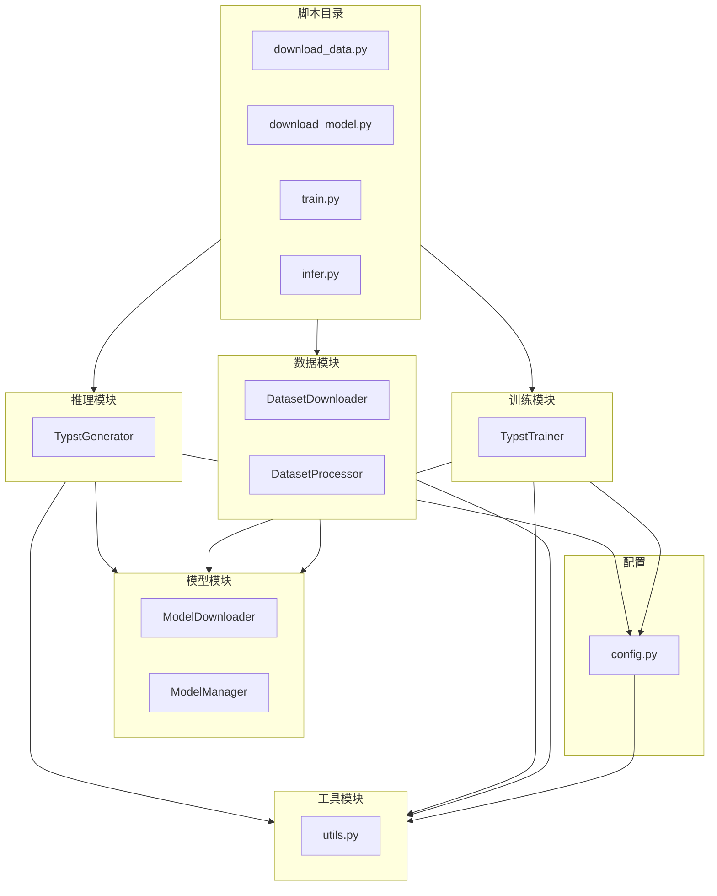

# Typst Coder

本项目是一个基于 Qwen3-0.6B 微调的 Typst 代码生成语言模型。

## 项目结构

```
typst-coder/
├── CLAUDE.md              # 项目说明文档
├── LICENSE                # MIT许可证
├── README.md              # 本文档
├── requirements.txt       # Python依赖
├── .gitignore             # Git忽略配置
│
├── src/                   # 源码目录
│   ├── __init__.py
│   ├── config.py          # 配置文件
│   │
│   ├── data/              # 数据处理模块
│   │   ├── __init__.py
│   │   └── downloader.py  # 数据集下载和预处理
│   │
│   ├── model/             # 模型模块
│   │   ├── __init__.py
│   │   └── downloader.py  # 模型下载和加载
│   │
│   ├── training/          # 训练模块
│   │   ├── __init__.py
│   │   └── trainer.py     # 训练器实现
│   │
│   ├── inference/         # 推理模块
│   │   ├── __init__.py
│   │   └── generate.py    # 代码生成器
│   │
│   └── utils/             # 工具模块
│       └── __init__.py
│
├── scripts/               # 脚本目录
│   ├── download_data.py   # 下载数据脚本
│   ├── download_model.py  # 下载模型脚本
│   ├── train.py           # 训练脚本
│   └── infer.py           # 推理脚本
│
├── data/                  # 数据目录
│   ├── raw/               # 原始数据
│   └── processed/         # 处理后数据
│
├── model/                 # 模型目录
│   └── qwen3-0.6b/        # Qwen3-0.6B模型
│
├── outputs/               # 训练输出目录
└── docs/                  # 文档目录
```

## 模块结构图



## 安装

```bash
# 克隆项目
git clone <your-repo-url>
cd typst-coder

# 创建虚拟环境
conda create -n typst-coder python=3.14
conda activate typst-coder

# 安装依赖
pip install -r requirements.txt
```

## 数据准备

### 下载数据集

训练数据来源: [HuggingFace TechxGenus/Typst](https://huggingface.co/datasets/TechxGenus)

```bash
# 下载并处理数据
python scripts/download_data.py
```

### 手动下载链接

- 训练集: https://huggingface.co/datasets/TechxGenus/Typst-Train/resolve/main/typst_train.json?download=true
- 测试集: https://huggingface.co/datasets/TechxGenus/Typst-Test/resolve/main/typst_test.json?download=true

## 模型准备

### 下载预训练模型

```bash
# 下载 Qwen3-0.6B 模型
python scripts/download_model.py
```

模型将保存在 `model/qwen3-0.6b/` 目录。

## 训练

### 基本训练

```bash
python scripts/train.py
```

### 自定义参数

```bash
python scripts/train.py \
    --epochs 3 \
    --batch-size 4 \
    --lr 1e-4
```

### 使用配置文件

```bash
python scripts/train.py --config config/training_config.json
```

训练完成后，模型将保存在 `outputs/qwen3-0.6b-typst/` 目录。

## 推理

### 交互模式

```bash
python scripts/infer.py --demo
```

### 单次生成

```bash
python scripts/infer.py \
    --instruction "编写一个Typst函数来计算阶乘" \
    --output result.typ
```

### 批量生成

```bash
python scripts/infer.py --batch prompts.json --output results.json
```

## 目录说明

| 目录 | 说明 |
|------|------|
| `data/raw/` | 原始数据集（train.json, test.json） |
| `data/processed/` | 处理后的数据集 |
| `model/qwen3-0.6b/` | Qwen3-0.6B 预训练模型 |
| `outputs/` | 训练输出目录 |
| `src/` | 源代码目录 |
| `scripts/` | 可执行脚本目录 |

## 许可证

本项目采用 MIT 许可证开源。

## 参考资料

- [Qwen3](https://huggingface.co/Qwen/Qwen3-0.6B)
- [PEFT](https://github.com/huggingface/peft)
- [Typst](https://typst.app/)
